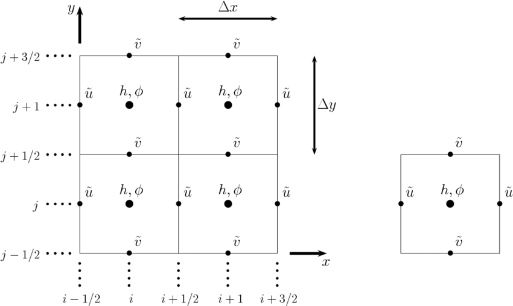

# P3 Overview - (Linearized) Shallow Water Simulation

Welcome to P3 everyone! We hope that you enjoyed simulating particle hydrodynamics, which was a problem that introduced you to less than uniform computation. What we mean by this is that particles were not evenly divided in space, so simply looping through all cells would often lead to wasted work (as most cells were empty). In this assignment, you will work with a structured grid computation, where every cell will be (roughly) the same, so you can't be too clever in how you divide the work.

# What are the Linearized Shallow Water Equations (SWE)?

The original shallow water equations, in non-conservative form, are given by

$$
\begin{align*}
\frac{\partial h}{\partial t} + \frac{\partial}{\partial x} \left((H + u) u\right) + \frac{\partial}{\partial y} \left((H + u) v\right) = 0, \\
\frac{\partial u}{\partial t} + u \frac{\partial u}{\partial x} + v \frac{\partial u}{\partial y} = -g \frac{\partial h}{\partial x} - ku + \nu \left(\frac{\partial^2 u}{\partial x^2} + \frac{\partial^2 u}{\partial y^2}\right), \\
\frac{\partial v}{\partial t} + u \frac{\partial v}{\partial x} + v \frac{\partial v}{\partial y} = -g \frac{\partial h}{\partial y} - kv + \nu \left(\frac{\partial^2 v}{\partial x^2} + \frac{\partial^2 v}{\partial y^2}\right)
\end{align*}
$$

where $(u, v)$ describes the velocity field of a body of water, $H$ is the mean depth of the water (i.e. the average) at a particular point, $h$ is how much the height deviates from the mean at a given time, $k$ describes the viscous drag (basically a friction force), and $\nu$ is the viscosity (how much a liquid wants to flow away from itself). In some other sources you might also see a term dealing with $f$, the Coriolis parameter, which takes into account the rotation of the Earth. However, since we assume we are on a scale much smaller than this, we ignore this term. As you can see, these equations are quite the doozy, though if you'd like to know more please see the [Wikipedia](https://en.wikipedia.org/wiki/Shallow_water_equations) or ask Professor Bindel (he knows way more than us TAs!).

Since this is so complicated, and I have no background in PDEs, I decided to use the simpler, linearized shallow water equations. Essentially, if we assume that our height deviation is small relative to the average height (i.e. $h \ll H$) and that the higher order terms of velocity are quite small, through some derivations we can reach

$$
\begin{align*}
\frac{\partial h}{\partial t} + H \left(\frac{\partial u}{\partial x} + \frac{\partial v}{\partial y}\right) = 0, \\
\frac{\partial u}{\partial t} = -g \frac{\partial h}{\partial x} - ku, \\
\frac{\partial v}{\partial t} = -g \frac{\partial h}{\partial y} - kv
\end{align*}
$$

Since we want our equations to be energy conserving (as a check of our correctness), we assume that $k = 0$, so we don't want to dissipate energy due to friction. Now that we have a much simpler looking set of equations, how do we actualy solve them? If you already know about solving PDEs numerically you can skip this next section, but if not (like me), then please read on!

# Discretizing the Problem in Space

In order to actually solve this problem numerically, we need to be able to compute derivatives with respect to space as well as time. Looking at the definition of a derivative

$$
\begin{align*}
f'(x) = \lim_{h \rightarrow 0} \frac{f(x + h) - f(x)}{h}
\end{align*}
$$

we see that it is the limit of a difference quotient. Given that, we could imagine that for a fixed (but small) $h$, the corresponding finite difference quotient should be a good approximation. Therefore, given a rectangular domain $R \subseteq \mathbb{R}^2$, we can discretize it into evenly spaced partitions $(x_1, \dots, x_n)$ and $(y_1, \dots, y_n)$, and then take the difference quotient of adjacent points to approximate spatial derivatives. In other words, we would say that the spatial derivative in the $x$ direction of a function $f$ at $(x_i, y_j)$ is approximately given by

$$
\begin{align*}
\hat{\frac{\partial f}{\partial x}}(x_i, y_j) = \frac{f(x_{i + 1}, y_j) - f(x_i, y_j)}{x_{i + 1} - x_i} = \frac{f(x_{i + 1}, y_j) - f(x_i, y_j)}{\Delta x}
\end{align*}
$$

with a similar formula for $y_i$. Using this idea, we can approximate all of the spatial derivatives for our functions $h$, $u$, and $v$. To be particularly clever, since our $u$ and $v$ functions govern the horizontal and vertical velocities of our field, we can imagine that they exist on the boundaries of our cells (since fluid flows into and out of our cells). This is called an Arakawa C grid, and an image is shown below ([source](https://www.researchgate.net/figure/The-Arakawa-C-grid-layout-of-the-variables-in-our-numerical-scheme-The-domain-is-divided_fig4_267118062)):

As you can see, we take the $u$ values on the horizontal edges of our cells, and the $v$ values on the vertical edges of our cells. The $h$ values, on the other hand, are in the center of our cells. I did this because it was popular for other SWE solvers, though I don't know if there's a particular numerical reason why it is used. This becomes a little difficult because if we have $n$ points in our horizontal partition for the $h$ function, we will have $n + 1$ points in our partition for the $u$ function (since we have the last edge as well). Therefore, we need to rely on boundary conditions to tell us what happens there.

# Discretizing the Problem in Time

Now that we're able to compute our spatial derivatives, how do we step our equations forward in time? Re-arranging our linear SWE equations, we see that the derivatives of each of our variables with respect to time are given by

$$
\begin{align*}
\frac{\partial h}{\partial t} &= -H \left(\frac{\partial u}{\partial x} + \frac{\partial v}{\partial y}\right), \\
\frac{\partial u}{\partial t} &= -g \frac{\partial h}{\partial x}, \\
\frac{\partial v}{\partial t} &= -g \frac{\partial h}{\partial y}
\end{align*}
$$

Since these give us the rate of change of each of our variables with respect to time, if we take a small discrete time step $\Delta t$ then we could imagine that we could use them to approximate the function value at our next time step. Using a difference quotient, we can reason that

$$
\begin{align*}
\frac{f(t + \Delta t) - f(t)}{\Delta t} \approx f'(t) \implies f(t + \Delta t) \approx f(t) + f'(t) \cdot \Delta t.
\end{align*}
$$

This is called Euler's method, and is first order, as we are essentially using our derivative as a linearization about the point $t$ to predict what the next value of our function will be. However, we could imagine that if our function is quite non-linear this approximation won't hold well, so we could imagine using higher order (i.e. with regards to a Taylor expansion) schemes. I based my implementation off of this [guide](https://empslocal.ex.ac.uk/people/staff/gv219/codes/shallowwater.pdf), which uses a 3rd order linear multistep method (i.e. it uses previous evaluations to make its next prediction) called the [Adams-Bashford method](https://en.wikipedia.org/wiki/Linear_multistep_method#Adams%E2%80%93Bashforth_methods), which is given by

$$
\begin{align*}
AB(f(t_4)) = f(t_3) + \Delta t \left(\frac{23}{12} f'(t_3) - \frac{16}{12} f'(t_2) + \frac{5}{12} f'(t_1)\right)
\end{align*}
$$

Here, $t_4, t_3, t_2, t_1$ are adjacent times (i.e. they are $\Delta t$ apart). You could imagine this serves to smooth out our approximations a little, since we balance out our current derivative with that of previous iterations. Empirically, I've found that in situations where's Euler's method blows up (i.e. solutions diverge to infinity), this method does not, so I feel comfortable using it (at least when things aren't too crazy).

# Putting it Together

Using these two ideas, if we let $h_{x,y}^t$ represent the value of our height function at timestep $t$ and position $(x, y)$ in our grid (and do the same for $u$ and $v$), then we approximate their derivatives with respect to time as

$$
\begin{align*}
\partial_t h_{x, y}^t &= -H \left(\frac{u_{x + 1, y}^t - u_{x, y}^t}{\Delta x} + \frac{v_{x, y + 1}^t - v_{x, y}^t}{\Delta y}\right), \\
\partial_t u_{x + 1, y}^t &= -g \left(\frac{h_{x + 1, y}^t - h_{x, y}^t}{\Delta x}\right), \\
\partial_t v_{x, y + 1}^t &= -g \left(\frac{h_{x, y + 1}^t - h_{x, y}^t}{\Delta y}\right)
\end{align*}
$$

and then step them forward using the Adams-Bashforth method. For the $u$ and $v$ equations we use $(x + 1, y)$ and $(x, y + 1)$ because we have one more $u$ and $v$ value in the vertical and horizontal directions than for $h$, so we need to offset ourselves by one.'

# Optimization

Now that you've gotten a little background into the actual problem we're trying to solve, it's up to you to implement it in CUDA and MPI, and then try and optimize it as much as possible! We've included a basic serial implementation in `serial/basic_serial.c`, and have given you a starter template for the CUDA and MPI versions in `gpu` and `mpi` respectively. The main function is in `common` along with a bunch of helpful indexing macros, so feel free to look in their to see what's going on. With that, good luck!